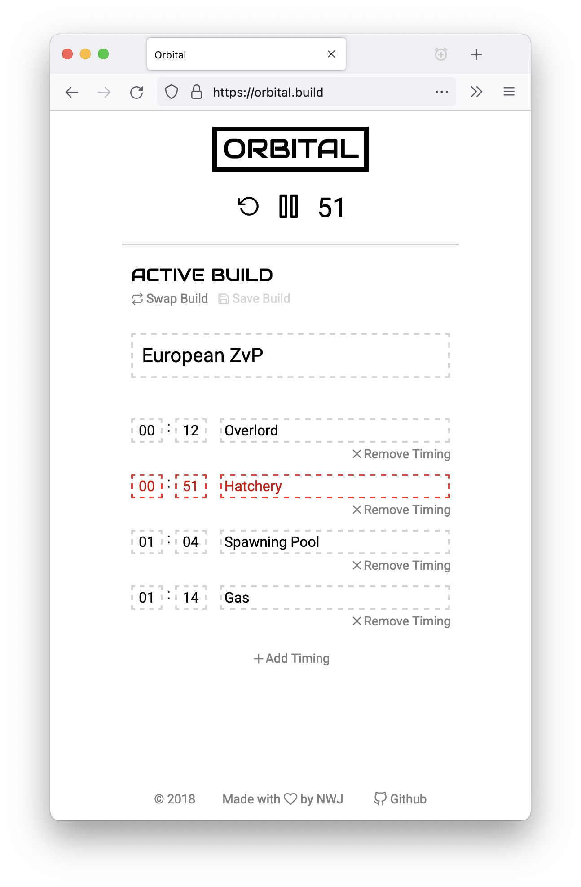

# Orbital

A tool for learning Starcraft 2 builds and timings. Originally built for a Braze hackday back in 2018, as a way to experiment with Elm and the (new, at the time) browser text-to-speech API. Orbital is unmaintained at this point in time.

### Screenshots:

### Built with:

- Elm
- Webpack
